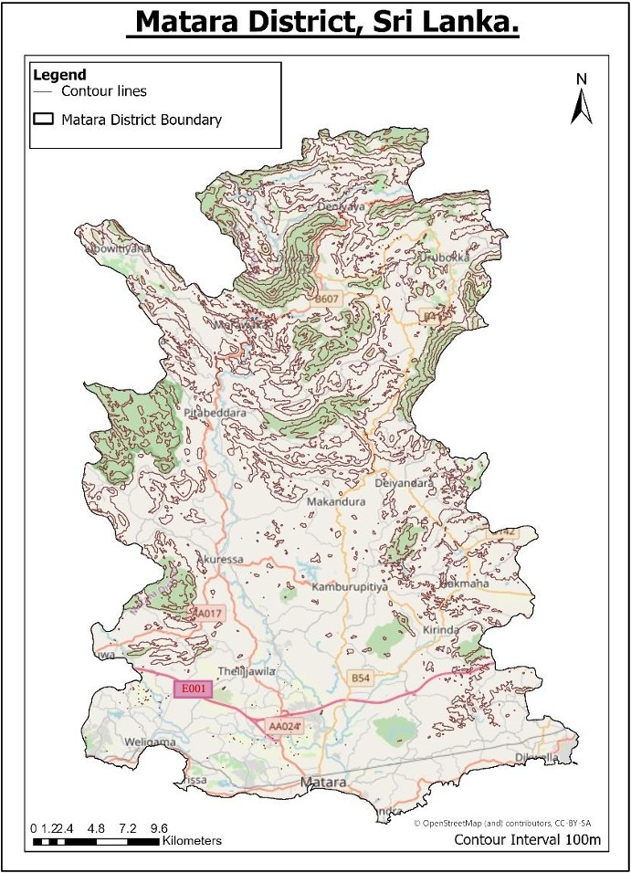
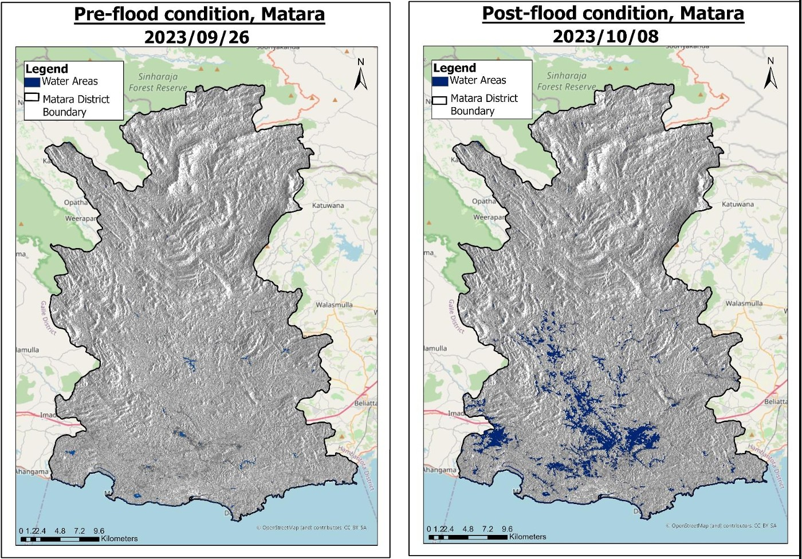
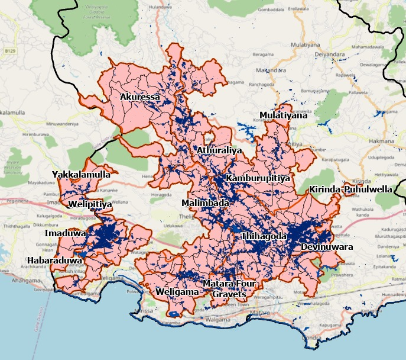

# Matara-District-Flood-Analysis
This project analyzes the impact of flooding in Matara District, Sri Lanka during September–October 2023 using Sentinel-1 Synthetic Aperture Radar (SAR) imagery.
## Overview

This project analyzes the **impact of flooding in Matara District, Sri Lanka** during September–October 2023 using **Sentinel-1 Synthetic Aperture Radar (SAR) imagery**.  
The study compares **pre-flood** (26th September 2023) and **post-flood** (8th October 2023) conditions to assess the **spatial extent of flooding**, particularly in agricultural areas, settlements, and infrastructure.  

SAR-based flood mapping is especially useful because it can **penetrate clouds and rainfall**, providing reliable flood monitoring even under extreme weather conditions.

---

## Study Area

  
   <em>Study Area, Matara District</em>

Matara District is located in the Southern Province of Sri Lanka, covering approximately 1,301 km² along the southern coastline. The district consists of coastal lowlands, river floodplains, and gently undulating inland terrain, making it highly susceptible to flooding.

A key hydrological feature is the Nilwala River, which flows from the central highlands through Matara before draining into the Indian Ocean. Its extensive alluvial floodplains, widely used for paddy cultivation, are particularly vulnerable to seasonal inundation.

The district falls within Sri Lanka’s wet zone, receiving significant rainfall from the Southwest Monsoon (May–September) and the Second Inter-Monsoon (October–November). Intense and prolonged rainfall, combined with flat terrain and poor drainage, frequently leads to riverine flooding and surface water accumulation.

The interaction of monsoonal rainfall, low-lying terrain, and intensive land use makes Matara District a highly flood-prone region, providing an ideal setting for SAR-based flood analysis.

---

## Data Used

| Data | Source | Description |
|------|--------|-------------|
| Sentinel-1 SAR | [Copernicus Open Access Hub](https://browser.dataspace.copernicus.eu) | Pre-flood (26-Sep-2023) and Post-flood (08-Oct-2023) imagery |
| DEM | Generated from Sentinel-1 product| Used for terrain correction and flood mapping |
| Matara District boundary | (https://diva-gis.org/data.html) | Clipping flood extent to study area |
| Road network | OpenStreetMap / Local GIS sources | For infrastructure impact assessment |

> **Note:** Large SAR products are not included in this repository. Download links are provided.

---
## Tools & Software

- **SNAP (ESA Sentinel Application Platform)** – SAR pre-processing and water extraction  
- **ArcGIS Pro** – Mapping, spatial analysis, attribute calculation  
- **Other GIS datasets** – DEMs, shapefiles for roads and administrative boundaries  
---
## Methodology

### 1. SAR Pre-processing (in SNAP)

1. **Import Sentinel-1 images** (pre- and post-flood)  
2. **Thermal Noise Removal** – Reduce signal noise from thermal effects  
3. **Orbit File Correction** – Improve geometric accuracy using precise satellite orbit data  
4. **Radiometric Calibration** – Convert backscatter values to comparable measurements (Gamma Nought)  
5. **Terrain Correction (Range-Doppler)** – Align SAR images to real-world coordinates using DEM  
6. **Water Extraction** – Identify flooded areas using thresholding on VV/VH polarizations  
7. **Export processed water layer** – GeoTIFF format for use in ArcGIS  

### 2. GIS Analysis (in ArcGIS Pro)

1. **Clip water layer** to Matara District boundary  
2. **Dissolve water and land polygons** for better visualization  
3. **Calculate water-covered area and percentage** pre- and post-flood  
4. **Overlay roads and settlements** to assess infrastructure impact  
5. **Map flood extent in agricultural lands** (particularly paddy fields along Nilwala River)  
6. **Compare pre- and post-flood maps** to quantify inundation and land cover changes  

---
## Results

| Metric | Pre-Flood (26-Sep-2023) | Post-Flood (08-Oct-2023) | Change |
|--------|------------------------|--------------------------|--------|
| Water-covered area | 13.15 km² (1.01%) | 40.24 km² (3.09%) | +27.09 km² (+206%) |
| Land area | 1,288.15 km² (98.99%) | 1,261.06 km² (96.91%) | -27.09 km² (-2.1%) |

- The 206% increase in water extent indicates a substantial escalation in flood magnitude, serving as a strong proxy for flood severity and highlighting significant impacts on low-lying agricultural and settlement areas.

**Observations:**

- Flooding concentrated in **southern and central parts** of Matara District

  
   <em>Pre and Post flood maps</em>

- Significant inundation along Nilwala river basin.
- Infrastructure impact: Southern Expressway sections were impassable due to flooding.
- Agricultural impact: Large paddy fields in Thihagoda, Malimbada, Athuraliya, and Akuressa submerged, likely causing crop damage and economic loss.

  
   <em>Flooded Areas</em>

---

## Future Implications
- Use multi-temporal SAR for flood progression analysis
- Integrate rainfall data for better flood modeling
- Apply machine learning for automated flood detection

Author : Theekshana Pathirana
BSc. in Geographical Information Science

